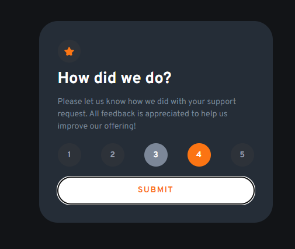
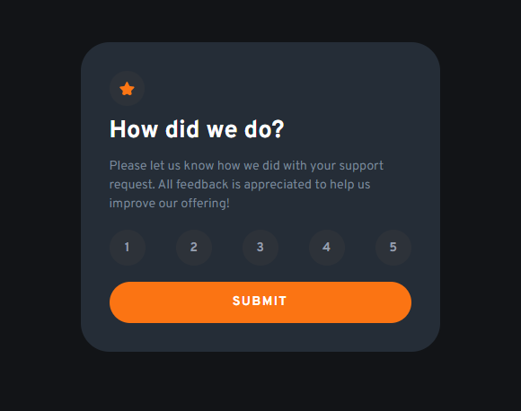
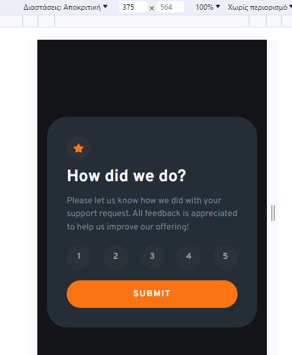
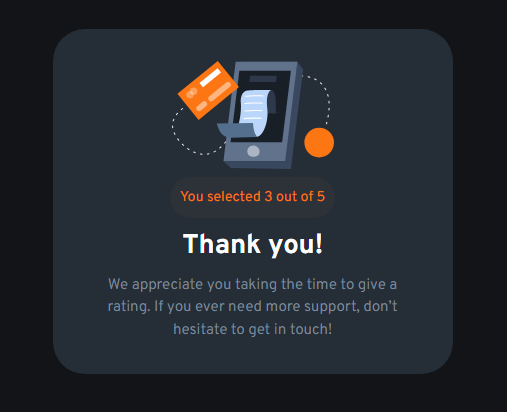

# Frontend Mentor - Interactive rating component solution

This is a solution to the [Interactive rating component challenge on Frontend Mentor](https://www.frontendmentor.io/challenges/interactive-rating-component-koxpeBUmI). Frontend Mentor challenges help you improve your coding skills by building realistic projects.

## Table of contents

- [Overview](#overview)
  - [The challenge](#the-challenge)
  - [Screenshot](#screenshot)
  - [Links](#links)//dint do that yet
- [My process](#my-process)
  - [Built with](#built-with)
  - [What I learned](#what-i-learned)
  - [Continued development](#continued-development)
  - [Useful resources](#useful-resources)
- [Author](#author)//miss a link here to

## Overview

This was overall a fun challenge that tested both css and javascript skills.

### The challenge

Users should be able to:

- View the optimal layout for the app depending on their device's screen size
- See hover states for all interactive elements on the page
- Select and submit a number rating
- See the "Thank you" card state after submitting a rating

### Screenshot






### Links

- Solution URL: [Add solution URL here](https://your-solution-url.com)
- Live Site URL: [Add live site URL here](https://your-live-site-url.com)

## My process

My proccess for this project was straight forward:
-First step was to define my html structure and make a starter CSS file so it will be easier later on to style the whole project
-Started of with adding a CSS reseter from (https://www.joshwcomeau.com/css/custom-css-reset/)
-Added some Custom variables to help me in this project(guided by the style-guide.md)
-Second step was to start styling the Rating State
-Started styling Rating State when i was happy with it i went to js
-With Javascript i tried to make the 1 - 5 rating interactive while also keepeing track of which rating is selected(thats for the Thankyou state)
-Third step was to style the Thankyou State

### Built with

- Semantic HTML5 markup
- CSS custom properties
- Flexbox
- CSS Grid
- Mobile-first workflow

### What I learned

I started my journey using react/nextjs/tailwind and got comfortable with the state/components and the ease of use from both react and tailwind that they provide.It was fun going back to "raw" javascript and trying to remember/figure out how can I manipulate the DOM to achieve the desire outcome.

Im very proud of the clean HTML/CSS code that i wrote(Simple to understand and very easy for maintance).Here is an example from both:

```html
<div class="rating__content" id="form">
  

  <p class="rating__title">How did we do?</p>

  <p class="rating__descr">
    Please let us know how we did with your support request. All feedback is
    appreciated to help us improve our offering!
  </p>

  <div class="flex-group">
    <d class="rating__value" data-rating="1">1</d>
    <d class="rating__value" data-rating="2">2</d>
    <d class="rating__value" data-rating="3">3</d>
    <d class="rating__value" data-rating="4">4</d>
    <d class="rating__value" data-rating="5">5</d>
  </div>

  <button class="button" id="submitbtn">Submit</button>
</div>
```

```css
:root {
  /* COLORS */
  --clr-primary-500: hsl(25, 97%, 53%);

  --clr-neutral-white-100: hsl(0, 0%, 100%);
  --clr-neutral-grey-300: hsl(217, 12%, 63%);
  --clr-neutral-grey-400: hsl(216, 12%, 54%);
  --clr-neutral-grey-700: hsl(216, 12%, 20%);
  --clr-neutral-dark-blue-800: hsl(213, 19%, 18%);
  --clr-neutral-dark-blue-900: hsl(216, 12%, 8%);

  /* Font Family */
  --ff-base: "Overpass", sans-serif;

  /* FONT WEIGHT */
  --fw-regular: 400;
  --fw-bold: 700;

  /* Margin / Padding */
  --content-padding: 2rem;
  --content-spacing: 0.5rem;
}
```

### Continued development

I would love to learn more about CSS and Javascript.

### Useful resources

- [CSS Reset](https://www.joshwcomeau.com/css/custom-css-reset/) - This helped me a ton by starting of my Css file on the right foot. I really liked this pattern and will use it going forward.

## Author

- Website - [Thodoris Diamantidis](https://www.your-site.com)// ddnt change that yet
- Frontend Mentor - [@Thodoris-Diamantidis](https://www.frontendmentor.io/profile/Thodoris-Diamantidis)
